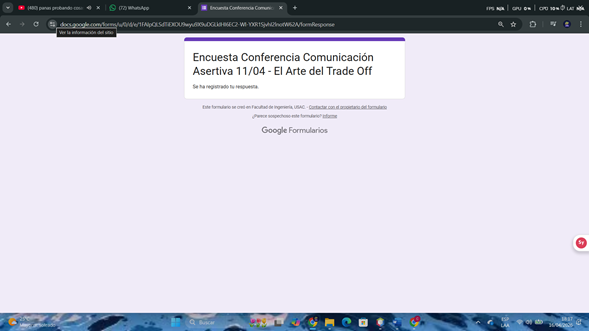

### Resumen del laboratorio
Durante el laboratorio de hoy se dieron 2 temas bastante importantes a nivel profesional como en el académico. 
Uno de ellos son los limites y criticas, dos situaciones muy comunes en entornos académicos y profesionales, es por ello que se introduce el tema de como decir que no, muchas situaciones ameritan decir no, sin embargo el saber como decir no profesionalmente nos permite generar limites que puedan respetar nuestros derechos y no permitir que se sobrepasen
##### Estructura para decir no
1. tendremos que expresar la situación de manera clara
2. Dejar en claro el limite 
3. Explicar brevemente la razón del límite
4. Dar una alternativa ante dicha situación

La negociación de límites es una manera fundamental de evitar tensiones, colaboraciones y una comprensión clara de las situaciones para tener las metas y trabajos en claro
##### FeedBack
Una de las técnicas fundamentales debido que con ella de forma asertiva nos permite mejorar de manera constante los errores que se van encontrando durante la implementaciones de proyectos para ello se tienen dos técnicas muy utilizadas 
1. Técnica del sandwich: Consiste en brindar un aspecto positivo, luego la mejora o la observación y por último un aspecto positivo
2. Situacional: Consiste en centrarse únicamente en los hechos o situaciones y separandolo completamente 
Siempre al momento de dar un feedback es importante mantener el respeto, centrarse en conductas y no en las personas quienes ejecutaron dicha situación, siempre con una escucha activa 
##### Regulación emocional
Muchas veces cuando se recibe un feedback no asertivo nuestras emociones nos juegan en contra es por ello importante conocer como regular dichas emociones ante un feedback para que podamos responder de una manera asertiva teniendo en cuentra el control de la respiración, control del tono de voz y lenguaje corporal y mantener siempre la profesionalidad

---
##### Persuasión
Este concepto se introduce como las técnicas que se tienen para influir en las decisiones o actitudes de los demás sin embargo esto en ámbitos profesionales se busca para dar a conocer una idea o propuesta es por ello que la persuasión necesita una credibilidad y evidencia de datos siendo que es más facil la persuasión cuando se dan datos verificables, usando fuentes confiables para presentar evidencias siempre manteniendo una coherencia en el mensaje. 
##### Framing
Al momento de dar una idea se tiene que tener una estructura, esto se refiere framing, a la estructura en como se presenta la idea para influir en el receptor, un buen framing siempre desataca la parte positiva, se muestra como una solución y se adapta a la audiencia.
##### Negociación
Pero, ¿Qué sucede cuando al momento de dar la idea no les convence? Aqui viene la parte de negociación que consiste en el intercambio de propuestas entre dos o más personas donde buscan una situación que beneficie sus intereses mutuos. Al saber negociar, nos permite resolver diferencias, evitar conflictos y establecer acuerdos claros de mutuo beneficio, para ello necesitamos estar preparados ante situaciones como por ejemplo 
1. Batna: Representa la mejor propuesta o solución si no se concreta un acuerdo (para la negociación)
2. Trade-OFF: Un trade off consiste en ofrecer alternativas donde se tiene un equilibrio, en esta situación se pueden dar por ejemplo rapido pero sin escalabilidad o tardado pero escalable, se ofrecen alternativas donde alguien cede para poder llegar a un acuerdo

--- 
### Imagen
 